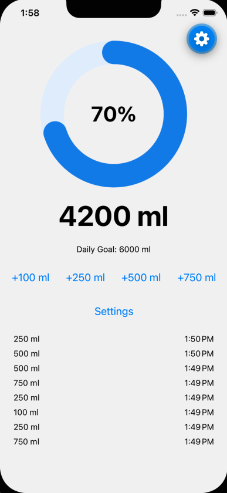

# 🚰 HydroTrack

A clean, offline-first water intake tracker built with React Native and Expo. Log your hydration with one tap, set a daily goal, and watch an animated progress ring fill as you go — all persisted locally on device.

<!-- Add 2–3 screenshots here once you have them. A GIF of tapping "+250" and the ring filling is the money shot. -->
<!--  -->

## Features

- **One-tap logging** — quick-add buttons (100 / 250 / 500 ml)
- **Editable daily goal** — set and persist your own target
- **Animated progress ring** — visual completion built with SVG
- **Today's log** — a running, time-stamped history of the day's intake
- **Offline & persistent** — all data stored on device; survives app restarts

## Tech Stack

| Layer | Choice |
|---|---|
| Framework | React Native (Expo, managed workflow) |
| Language | TypeScript |
| State | Zustand (with `persist` middleware) |
| Storage | AsyncStorage |
| Graphics | react-native-svg |
| IDs | expo-crypto |

## Tech Decisions

A few deliberate calls behind the build:

- **Single source of truth, derived everything else.** The store holds only the raw log of intake entries. Today's total, completion %, and the history list are all *derived* from that log at render time — never stored separately. This makes state drift impossible: there's only one number that's real.
- **Zustand over Context/Redux.** Minimal boilerplate, and slice-based selectors mean components re-render only when the data they actually use changes — not on every store update.
- **Local persistence via AsyncStorage + `persist` middleware.** v1 needs no backend; the middleware auto-saves on every change and rehydrates on launch.
- **Hand-built SVG progress ring.** Using `react-native-svg` and the stroke-dash technique gives full control over the visual without pulling in a heavy charting dependency.
- **TypeScript throughout** for safer refactors and clearer component contracts.

## Project Structure

```
src/
  components/
    WaterRing.tsx      # SVG progress ring (takes a `percent` prop)
  store/
    useHydrationStore.ts  # Zustand store: entries, goal, actions, persistence
App.tsx                # Home screen: ring, total, goal editor, quick-add, history
```

## Getting Started

**Prerequisites:** Node.js, and the [Expo Go](https://expo.dev/go) app on your phone (or an iOS/Android simulator).

```bash
# install dependencies
npm install

# start the dev server
npx expo start
```

Scan the QR code with Expo Go (Android) or the Camera app (iOS), or press `i` / `a` to launch a simulator.

## Roadmap

- ⏰ Scheduled hydration reminders (`expo-notifications`, via a development build)
- 📊 Weekly & monthly intake charts
- 🥤 Beverage hydration scoring (coffee/alcohol count differently)
- 🌡️ Weather- and activity-adjusted daily goals
- ☁️ Optional cloud sync

## License

MIT

## Demo

[](https://github.com/user-attachments/assets/1f4d4739-bc4c-4555-9533-5e2e32cf9af6)

▶️ *Tap to watch — logging, goal editing, persistence, and reminders in 60 seconds.*
